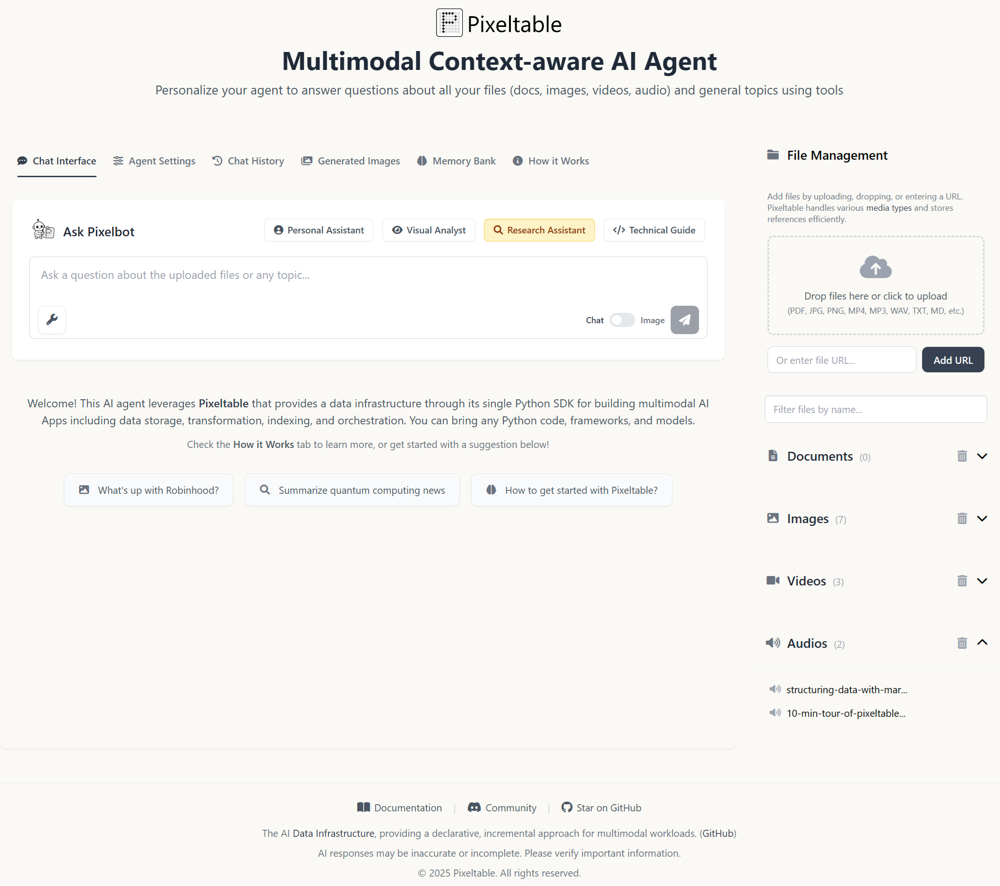
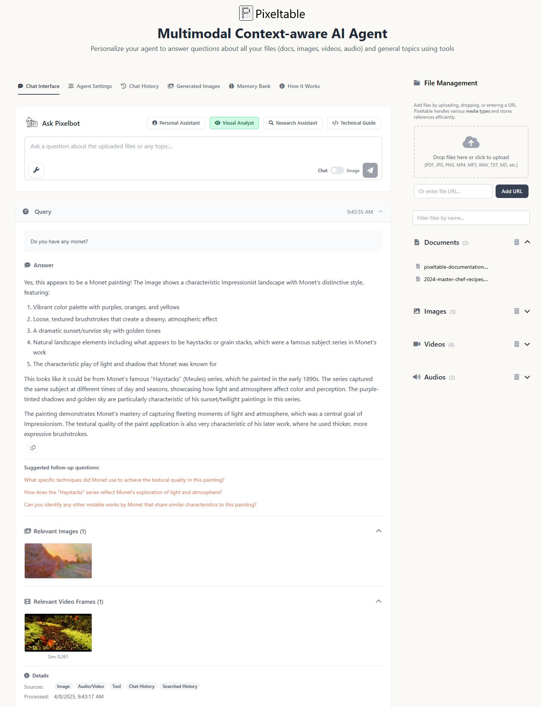
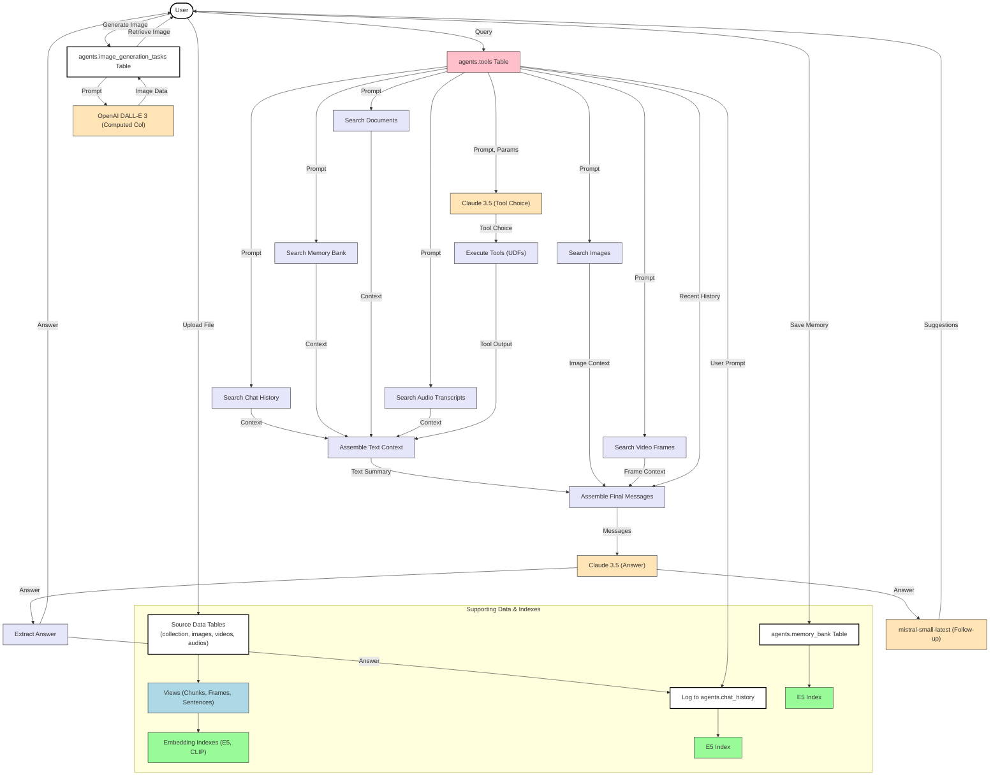

<h1>
  
  Pixelbot: Multimodal AI Agent with Pixeltable
</h1>

---

<div>

[](https://opensource.org/licenses/Apache-2.0)
[](https://discord.gg/QPyqFYx2UN)

</div>

<div align="center">
 <table>
   <tr>
     <td align="center" width="49%">
       
     </td>
     <td align="center" width="49%">
       
     </td>
   </tr>
  </table>
</div>

This application demonstrates **Pixelbot**, a multimodal AI agent built using [Pixeltable](https://github.com/pixeltable/pixeltable), open-source AI data infrastructure. The agent can process and reason about various data types (documents, images, videos, audio), use external tools, generate images, maintain a chat history, and utilize a persistent memory bank.

The frontend is built with Flask and vanilla JavaScript, providing a user-friendly interface for interaction.

## Key Features

- **Unified Multimodal Data Management**: Ingests and manages text, PDFs, images (JPG, PNG), videos (MP4), and audio files (MP3, WAV).
- **Declarative AI Pipelines**: Leverages Pixeltable's computed columns and views to declaratively define complex workflows including data processing, embedding generation, AI model inference, and more.
- **Semantic Search**: Implements vector search across:
    - Document chunks (`sentence-transformers`)
    - Images & Video Frames (`CLIP`)
    - Audio Transcripts (`sentence-transformers`)
    - Chat History (`sentence-transformers`)
    - Memory Bank items (`sentence-transformers`)
- **LLM Integration**:
    - **Reasoning & Tool Use**: Anthropic Claude 3.5 Sonnet
    - **Audio Transcription**: OpenAI Whisper
    - **Image Generation**: OpenAI DALL-E 3
    - **Follow-up Suggestions**: Mistral Small Latest
- **External Tools**: Integrates with external APIs for real-time information (e.g., NewsAPI, Yahoo Finance via `yfinance`, DuckDuckGo Search, and more).
- **Chat History**: Persistently stores and allows searching through conversation history.
- **Memory Bank**: Allows saving and semantically searching through important text snippets or code blocks.
- **Image Generation**: Generates images based on user prompts using DALL-E 3.
- **Responsive UI**: A clean web interface built with Flask, Tailwind CSS, and JavaScript for interacting with the agent, managing files, viewing history, and configuring settings.
- **Centralized Configuration**: Uses `config.py` to manage model IDs, default system prompts, LLM parameters, and other settings.

## Architecture Overview

Pixeltable serves as the central nervous system, orchestrating data flow, model execution, and state management. When a user submits a query:

1.  The query is inserted into the main `agents.tools` Pixeltable table.
2.  Pixeltable's computed columns trigger sequentially:
    -   Semantic searches across indexed documents, images, video frames, audio transcripts, memory bank, and chat history.
    -   An initial LLM call (Claude) analyzes the prompt and determines if any external tools are needed.
    -   If tools are required, Pixeltable executes the relevant User-Defined Functions (UDFs) via `pxt.invoke_tools`.
    -   Context from searches and tool outputs is assembled.
    -   Recent chat history is retrieved.
    -   A final LLM call (Claude) synthesizes the context, history, and original prompt to generate the main response.
    -   A follow-up LLM call (Mistral) generates potential next questions.
    -   The user query and assistant response are logged to the `agents.chat_history` table.
3.  The final answer, relevant context (images/video frames), and follow-up suggestions are returned to the UI.

Image generation requests follow a similar pattern, inserting into `agents.image_generation_tasks` and using a computed column to call the DALL-E API.



## Project Structure

```
.
├── .env                  # Environment variables (API keys)
├── .venv/                # Virtual environment files (if created here)
├── data/                 # Default directory for uploaded/source media files
├── logs/                 # Application logs
│   └── app.log
├── static/               # Static assets for Flask frontend (CSS, JS)
│   ├── css/
│   │   └── style.css
│   ├── image/
│   │   └── *.png
│   ├── js/
│   │   ├── api.js
│   │   └── ui.js
│   └── manifest.json
├── templates/            # HTML templates for Flask frontend
│   └── index.html
├── endpoint.py           # Flask backend: API endpoints and UI rendering
├── functions.py          # Python UDFs registered as Pixeltable functions/tools
├── config.py             # Central configuration (model IDs, defaults)
├── requirements.txt      # Python dependencies
├── setup_pixeltable.py   # Pixeltable schema setup script
└── README.md             # This file
```

## Pixeltable Schema Overview

Pixeltable organizes data in directories, tables, and views. This application uses the following structure within the `agents` directory:

```
agents/
├── collection              # Table: Source documents (PDF, TXT, etc.)
│   ├── document: pxt.Document
│   ├── uuid: pxt.String
│   └── timestamp: pxt.Timestamp
├── images                  # Table: Source images
│   ├── image: pxt.Image
│   ├── uuid: pxt.String
│   ├── timestamp: pxt.Timestamp
│   └── thumbnail: pxt.String(computed) # Base64 sidebar thumbnail
├── videos                  # Table: Source videos
│   ├── video: pxt.Video
│   ├── uuid: pxt.String
│   ├── timestamp: pxt.Timestamp
│   └── audio: pxt.Audio(computed)      # Extracted audio
├── audios                  # Table: Source audio files (MP3, WAV)
│   ├── audio: pxt.Audio
│   ├── uuid: pxt.String
│   └── timestamp: pxt.Timestamp
├── chat_history            # Table: Stores conversation turns
│   ├── role: pxt.String        # 'user' or 'assistant'
│   ├── content: pxt.String
│   └── timestamp: pxt.Timestamp
├── memory_bank             # Table: Saved text/code snippets
│   ├── content: pxt.String
│   ├── type: pxt.String         # 'code' or 'text'
│   ├── language: pxt.String    # e.g., 'python'
│   ├── context_query: pxt.String # Original query or note
│   └── timestamp: pxt.Timestamp
├── image_generation_tasks  # Table: Image generation requests & results
│   ├── prompt: pxt.String
│   ├── timestamp: pxt.Timestamp
│   └── generated_image: pxt.Image(computed) # DALL-E 3 output
├── tools                   # Table: Main agent workflow orchestration
│   ├── prompt: pxt.String
│   ├── timestamp: pxt.Timestamp
│   ├── initial_system_prompt: pxt.String
│   ├── final_system_prompt: pxt.String
│   ├── max_tokens, stop_sequences, temperature, top_k, top_p # LLM Params
│   ├── initial_response: pxt.Json(computed)  # Claude tool choice
│   ├── tool_output: pxt.Json(computed)       # Output from executed UDFs
│   ├── doc_context: pxt.Json(computed)       # Results from document search
│   ├── image_context: pxt.Json(computed)     # Results from image search
│   ├── video_transcript_context: pxt.Json(computed) # Results from video audio search
│   ├── audio_transcript_context: pxt.Json(computed) # Results from direct audio search
│   ├── video_frame_context: pxt.Json(computed) # Results from video frame search
│   ├── memory_context: pxt.Json(computed)    # Results from memory bank search
│   ├── chat_memory_context: pxt.Json(computed) # Results from chat history search
│   ├── history_context: pxt.Json(computed)   # Recent chat turns
│   ├── multimodal_context_summary: pxt.String(computed) # Assembled non-image/frame context string
│   ├── final_prompt_messages: pxt.Json(computed) # Fully assembled messages for final LLM
│   ├── final_response: pxt.Json(computed)    # Claude final answer generation
│   ├── answer: pxt.String(computed)          # Extracted text answer
│   ├── follow_up_input_message: pxt.String(computed) # Prompt for Mistral
│   ├── follow_up_raw_response: pxt.Json(computed) # Raw Mistral response
│   └── follow_up_text: pxt.String(computed) # Extracted follow-up suggestions
├── chunks                  # View: Document chunks
│   └── (Implicit: EmbeddingIndex: E5-large-instruct on text)
├── video_frames            # View: Video frames (1 FPS)
│   └── (Implicit: EmbeddingIndex: CLIP on frame)
├── video_audio_chunks      # View: Audio chunks from videos
│   └── transcription: pxt.Json(computed)   # Whisper transcription
├── video_transcript_sentences # View: Sentences from video transcripts
│   └── (Implicit: EmbeddingIndex: E5-large-instruct on text)
├── audio_chunks            # View: Audio chunks from direct audio files
│   └── transcription: pxt.Json(computed)   # Whisper transcription
└── audio_transcript_sentences # View: Sentences from direct audio transcripts
    └── (Implicit: EmbeddingIndex: E5-large-instruct on text)

# Embedding Indexes Enabled On:
# - agents.chunks.text
# - agents.images.image
# - agents.video_frames.frame
# - agents.video_transcript_sentences.text
# - agents.audio_transcript_sentences.text
# - agents.memory_bank.content
# - agents.chat_history.content
```

## Getting Started

### Prerequisites

-   Python 3.9+
-   API Keys:
    -   Anthropic (Claude)
    -   OpenAI (Whisper & DALL-E)
    -   Mistral AI (Mistral Small)
    -   NewsAPI (Optional, for news tool)
# Get API Keys from:
    -   [Anthropic](https://console.anthropic.com/)
    -   [OpenAI](https://platform.openai.com/api-keys)
    -   [Mistral AI](https://console.mistral.ai/api-keys/)
    -   [NewsAPI](https://newsapi.org/) (Optional, for news tool)
-   [Pixeltable](https://github.com/pixeltable/pixeltable) (Installed via `requirements.txt`)

### Installation

```bash
# 1. Create and activate a virtual environment (recommended)
python -m venv .venv
# Windows: .venv\\Scripts\\activate
# macOS/Linux: source .venv/bin/activate

# 2. Install dependencies
pip install -r requirements.txt
```

### Environment Setup

Create a `.env` file in the project root and add your API keys. Keys marked with `*` are required for core functionality.

```dotenv
# Required for Core LLM Functionality *
ANTHROPIC_API_KEY=sk-ant-api03-...  # For main reasoning/tool use (Claude 3.5 Sonnet)
OPENAI_API_KEY=sk-...             # For audio transcription (Whisper) & image generation (DALL-E 3)
MISTRAL_API_KEY=...               # For follow-up question suggestions (Mistral Small)

# Optional (Enable specific tools by providing keys)
NEWS_API_KEY=...                  # Enables the NewsAPI tool
# Note: yfinance and DuckDuckGo Search tools do not require API keys.

# Optional: Flask Environment Setting
# Uncomment for development mode (debugging, auto-reload)
# FLASK_ENV=development
```

### Running the Application

1.  **Initialize Pixeltable Schema:**
    This script creates the necessary Pixeltable directories, tables, views, and computed columns defined in `setup_pixeltable.py`. It also inserts some sample data. Run this *once* initially.

    *Why run this?* This defines the data structures and processing logic within Pixeltable. It tells Pixeltable how to store, transform, and index your data.

```bash
python setup_pixeltable.py
```

2.  **Start the Web Server:**
    This runs the Flask application using the Waitress production server by default.

```bash
python endpoint.py
    ```

    To run in Flask's development mode (with auto-reload and debugging):

    ```bash
    # Set environment variable first
    # Windows: set FLASK_ENV=development
    # macOS/Linux: export FLASK_ENV=development
python endpoint.py
```

    The application will be available at `http://localhost:5000`.

**Data Persistence Note:** Pixeltable stores all its data (file references, tables, views, indexes) locally, typically in a `.pixeltable` directory created within your project workspace. This means your uploaded files, generated images, chat history, and memory bank are persistent across application restarts.

## Usage Overview

The web interface provides several tabs:

-   **Chat Interface**: Main interaction area. Ask questions, switch between chat and image generation modes. View results, including context retrieved (images, video frames) and follow-up suggestions. Save responses to the Memory Bank.
-   **Agent Settings**: Configure the system prompts (initial for tool use, final for answer generation) and LLM parameters (temperature, max tokens, etc.) used by Claude.
-   **Chat History**: View past queries and responses. Search history and view detailed execution metadata for each query. Download history as JSON.
-   **Generated Images**: View images created using the image generation mode. Search by prompt, view details, download, or delete images.
-   **Memory Bank**: View, search, manually add, and delete saved text/code snippets. Download memory as JSON.
-   **How it Works**: Provides a technical overview of how Pixeltable powers the application's features.

## Contributing

Contributions are welcome! Please feel free to submit pull requests or open issues.
